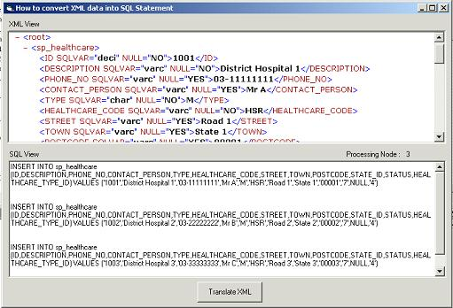



## How to read XML and convert to SQL statement

### Description

To convert XML data format into MySQL SQL Statement. Simple demo, how to use MSXML, Reading and Creating XML Data.
 
### More Info
 
XML Data

Must know the exact XML Structure before

inputing data into the application.

SQL Statement

Error if wrong XML Structure.

             |
---                |---
**Submitted On**   |2003-03-11 05:40:02
**By**             |[Mohd Idzuan Alias](https://github.com/Planet-Source-Code/PSCIndex/blob/master/ByAuthor/mohd-idzuan-alias.md)
**Level**          |Advanced
**User Rating**    |4.8 (29 globes from 6 users)
**Compatibility**  |VB 5\.0, VB 6\.0
**Category**       |[Miscellaneous](https://github.com/Planet-Source-Code/PSCIndex/blob/master/ByCategory/miscellaneous__1-1.md)
**World**          |[Visual Basic](https://github.com/Planet-Source-Code/PSCIndex/blob/master/ByWorld/visual-basic.md)
**Archive File**   |[How\_to\_rea1557803112003\.zip](https://github.com/Planet-Source-Code/mohd-idzuan-alias-how-to-read-xml-and-convert-to-sql-statement__1-43894/archive/master.zip)

